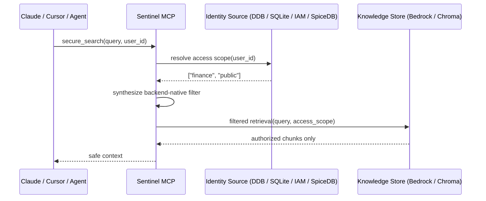

# Sentinel

[](LICENSE)

> **Stateless authorization for RAG and agentic systems.**
> Sentinel enforces access control **before retrieval**, so models and agents only see data a user is actually allowed to access.

> **License:** Sentinel is licensed under the [Elastic License 2.0](LICENSE). You may self-host and modify it freely. You may **not** offer it as a hosted or managed service to third parties.

---

## Why Sentinel Exists

Most RAG systems are optimized for relevance first.

The problem is that retrieval is often **identity-blind**.

A user asks a question, the system runs semantic search, and relevant chunks are sent to the model. If one of those chunks is sensitive and the model has already seen it, prompt-level guardrails are too late. The security failure happened at retrieval time, not generation time.

Sentinel exists to move authorization **out of the prompt** and **into the retrieval path**.

Instead of trusting the model to ignore private data, Sentinel verifies access at query time and constrains what can be retrieved in the first place.

---

## What Sentinel Is

Sentinel is a **stateless authorization layer** for RAG and agentic systems.

It sits between:

- an **identity source of truth**
  (for example DynamoDB, SQLite, IAM, or SpiceDB)

and

- a **knowledge system**
  (for example Bedrock Knowledge Bases or ChromaDB)

At query time, Sentinel:

1. resolves the caller's access scope from the identity system
2. translates that scope into backend-native retrieval filters
3. executes a constrained search against the knowledge system
4. returns only authorized results to the model or agent

This means the model never gets the chance to "accidentally" summarize a document the caller should not have been able to retrieve.

---

## What Makes It Different

### 1. Authorization happens before retrieval

Sentinel does not rely on prompt instructions or post-hoc filtering after sensitive data has already entered the context window.

### 2. Stateless by design

Sentinel does not become a new source of truth for permissions. It fetches access scope at runtime, applies enforcement, and drops the context.

### 3. Works with existing systems

You keep identities where they already live. You keep your vector/database stack. Sentinel connects the two and handles retrieval-time enforcement.

### 4. Built for modern AI workflows

Sentinel is MCP-native, connector-driven, and designed for RAG, internal copilots, and agentic systems that need real access boundaries.

---

## Architecture



### Core Model

Sentinel is built around a simple model:

- **Identity connectors** resolve who the user is allowed to access
- **Knowledge connectors** perform filtered retrieval against the target backend
- **The engine** orchestrates fail-closed enforcement between the two

This design keeps security logic portable across different identity providers and retrieval backends.

---

## Security Principles

| Principle | Behavior |
| :--- | :--- |
| **Zero Trust** | Never assumes a `user_id` has global access |
| **Fail-Closed** | No access scope = no retrieval |
| **Stateless** | No user data cached between MCP sessions |
| **Retrieval-Time Enforcement** | Access is checked before context is assembled |
| **Portable Enforcement** | Identity source and knowledge store remain decoupled |
| **Environment-Driven** | Runtime config is injected via `mcp.json` / environment variables |

---

## How It Works

```
Client (Claude Desktop / Cursor / Agent)
    |
    v
secure_search(query, user_id)
    |
    +---> Identity Store (DynamoDB / SQLite / IAM / SpiceDB)
    |        resolve access scope(user_id)
    |
    |     [Fail-Closed: if scope = {} -> deny, no KB call]
    |
    +---> Query Synthesis
    |        access scope -> backend-native metadata filter
    |
    +---> Knowledge Store (Bedrock / ChromaDB / future backends)
    |        filtered retrieval -> authorized chunks only
    |
    +---> Safe context returned to model / agent
```

---

## Supported Capabilities

### Protocol-native integration

Built on the [Model Context Protocol (MCP)](https://modelcontextprotocol.io) for integration with Claude Desktop, Cursor, and other MCP-compatible clients.

### Identity connectors

Sentinel can resolve access scope from:

- **`SQLiteConnector`** — local-first identity store for development and CI
- **`DynamoDBConnector`** — AWS-native identity lookup
- **`IAMConnector`** — derives access directly from IAM user/role tags
- **`SpiceDBConnector`** — ReBAC-style access resolution backed by [SpiceDB](https://github.com/authzed/spicedb)

### Knowledge connectors

Sentinel can enforce filtered retrieval over:

- **`ChromaConnector`** — local/self-hosted development workflows
- **`BedrockConnector`** — Amazon Bedrock Knowledge Bases

### Retrieval quality features

Sentinel preserves the retrieval features already present in the stack:

- hybrid search (BM25 + vector) where supported
- optional reranking via the Bedrock connector
- backend-native metadata filtering
- document ingestion with mandatory access tags

### Extensible connector model

You can add your own identity provider or knowledge backend by implementing the core connector interfaces.

See [CONNECTORS.md](CONNECTORS.md) for connector-specific setup.

---

## When to Use Sentinel

Sentinel is useful when you have:

- internal RAG over sensitive documents
- enterprise copilots that should respect user permissions
- agentic systems that retrieve or reason over scoped data
- a need to enforce access without duplicating permissions into a new security silo
- an existing identity source that should remain the source of truth

### When Sentinel Is a Strong Fit

Sentinel is especially useful if your system already has:

- a source of truth for user permissions
- document or chunk metadata that can represent access tags or scope
- a retrieval backend that supports metadata-aware filtering
- a need for enforcement that is explicit, auditable, and fail-closed

---

## Connector Ecosystem

### Available now

| Category | Connector | Description |
| :--- | :--- | :--- |
| **Identity** | `SQLiteConnector` | Local-first identity store for development, prototyping, and testing |
| **Identity** | `DynamoDBConnector` | AWS integration using indexed lookups for low-latency attribute-based access |
| **Identity** | `IAMConnector` | Zero-ops AWS identity using IAM user/role tags |
| **Identity** | `SpiceDBConnector` | ReBAC connector using SpiceDB relationship lookups |
| **Knowledge** | `ChromaConnector` | Open-source vector DB for local-first workflows |
| **Knowledge** | `BedrockConnector` | Native integration with Amazon Bedrock Knowledge Bases |

### Planned / roadmap

- Okta / Auth0
- Pinecone
- Elasticsearch / OpenSearch
- Additional enterprise identity and retrieval backends

---

## The Sentinel Lifecycle

Regardless of connector, Sentinel follows the same pattern:

1. **Fetch** — resolve access scope from the identity connector
2. **Synthesize** — build backend-native authorization filters
3. **Retrieve** — execute a constrained query against the knowledge connector
4. **Flush** — return results and persist no user-specific state

This is the core promise of Sentinel: **fetch, enforce, forget.**

---

## Quick Start

### Local development (SQLite + ChromaDB)

```bash
uv sync
python scripts/init_db.py
python scripts/ingest_seed_docs.py
```

Example MCP config:

```json
{
  "mcpServers": {
    "sentinel-rag": {
      "type": "stdio",
      "command": "uv",
      "args": ["run", "python", "-m", "sentinel.main"],
      "cwd": "/absolute/path/to/Sentinel",
      "env": {
        "SENTINEL_IDENTITY_STORE": "sqlite",
        "SQLITE_DB_PATH": "/absolute/path/to/Sentinel/data/permissions.db",
        "SENTINEL_KNOWLEDGE_STORE": "chroma",
        "CHROMA_PATH": "/absolute/path/to/Sentinel/data/chroma",
        "CHROMA_COLLECTION": "sentinel",
        "EMBEDDING_MODEL": "all-MiniLM-L6-v2"
      }
    }
  }
}
```

### AWS deployment (DynamoDB + Bedrock)

```json
{
  "mcpServers": {
    "sentinel-rag": {
      "type": "stdio",
      "command": "uv",
      "args": ["run", "python", "-m", "sentinel.main"],
      "cwd": "/absolute/path/to/Sentinel",
      "env": {
        "SENTINEL_IDENTITY_STORE": "dynamodb",
        "SENTINEL_KNOWLEDGE_STORE": "bedrock",
        "AWS_REGION": "us-east-1",
        "AWS_PROFILE": "your-profile",
        "DDB_TABLE_NAME": "your-identity-table",
        "BEDROCK_KB_ID": "your-kb-id",
        "BEDROCK_S3_BUCKET": "your-kb-bucket",
        "BEDROCK_DS_ID": "your-datasource-id",
        "BEDROCK_SEARCH_TYPE": "HYBRID"
      }
    }
  }
}
```

See [QUICKSTART.md](QUICKSTART.md) for full setup instructions, AWS auth options, and reranking configuration.

---

## MCP Tools

| Tool | Description |
| :--- | :--- |
| `secure_search(query, user_id)` | Search the KB and return only documents the user is authorized to retrieve |
| `ingest_document(text, access_tags, doc_id)` | Ingest text with mandatory access tags |
| `ingest_pdf(access_tags, doc_id, pdf_path)` | Ingest PDF content page by page with access tags |
| `list_user_relationships(user_id)` | *(SpiceDB only)* Auditing/debugging tool for user relationships |
| `check_config()` | Return current Sentinel runtime configuration |

---

## Extending Sentinel

Sentinel is connector-driven by design.

### Identity connector

Implement an `IdentityConnector` when you want to resolve permissions from a custom source.

```python
from sentinel.core.base import IdentityConnector

class MyCustomIdentity(IdentityConnector):
    async def get_tags(self, user_id: str) -> set[str]:
        tags = await my_api.fetch_user_metadata(user_id)
        return set(tags)
```

### Knowledge connector

Implement a `KnowledgeConnector` when you want to enforce retrieval over a custom backend.

```python
from sentinel.core.base import KnowledgeConnector

class MyCustomVectorStore(KnowledgeConnector):
    async def search(self, query: str, tags: set[str], n_results: int = 5) -> list[dict]:
        filter_criteria = {"access_tags": {"$in": list(tags)}}
        return await self.client.query(query, filter=filter_criteria, limit=n_results)

    async def ingest(self, text: str, access_tags: list[str], doc_id: str, metadata: dict) -> None:
        metadata["access_tags"] = access_tags
        await self.client.upsert(id=doc_id, vector=self.embed(text), metadata=metadata)
```

See [DEVELOPMENT.md](DEVELOPMENT.md) for full extension guidance, test conventions, and project layout.

---

## Example Access Model

### Knowledge base

| Document | Tags | Accessible to |
| :--- | :--- | :--- |
| Resume | `recruitment`, `private` | Users with `recruitment` or `private` |
| Q4 Financial Report | `finance` | Users with `finance` |
| Engineering Runbook | `engineering` | Users with `engineering` |
| Company Overview | `public` | Everyone |

### Identity store

| User | Tags |
| :--- | :--- |
| `aashish` | `recruitment`, `private` |
| `alice` | `finance`, `public` |
| `bob` | `engineering`, `public` |
| `charlie` | `finance`, `engineering`, `public` |

### Example

```
secure_search("AWS experience", user_id="aashish")
```

Sentinel:

1. resolves `aashish` to `{"recruitment", "private"}`
2. synthesizes an authorization filter
3. executes a constrained retrieval
4. returns only matching authorized chunks

If `alice` asks the same question, the query may still be semantically valid, but Sentinel will return nothing if the matching documents fall outside her authorized scope.

---

## Project Structure

```
sentinel/
├── main.py                         # FastMCP entry point
├── core/
│   ├── base.py                     # Abstract connector interfaces
│   └── engine.py                   # Orchestrator and fail-closed enforcement
└── connectors/
    ├── identity/
    │   ├── sqlite.py               # SQLite connector
    │   ├── ddb.py                  # DynamoDB connector
    │   ├── iam.py                  # IAM-based connector
    │   └── spicedb.py              # SpiceDB-based ReBAC connector
    └── knowledge/
        ├── chroma.py               # ChromaDB connector
        └── bedrock.py              # Bedrock KB connector

scripts/
├── setup_aws.py                    # Demo provisioning
├── seed_ddb.py                     # Seed DynamoDB test users
├── init_db.py                      # Init local SQLite DB
└── ingest_seed_docs.py             # Seed local documents
```

---

## Positioning

Sentinel is not a prompt wrapper.

It is not a replacement identity provider.

It is not another long-lived permissions database.

Sentinel is a stateless enforcement layer that connects identity truth to retrieval behavior so access control is applied where it matters most: **before data enters model context.**

---

## Documentation

- [QUICKSTART.md](QUICKSTART.md)
- [CONNECTORS.md](CONNECTORS.md)
- [DEVELOPMENT.md](DEVELOPMENT.md)
- [RESULTS.md](RESULTS.md)

---

## Citation

If you use Sentinel in academic or technical work, see [CITATION.cff](CITATION.cff).

---

## Contributing / Feedback

Issues, ideas, and connector requests are welcome.

If you are working on secure RAG, identity-aware retrieval, or agentic systems with real access boundaries, I'd love to hear how you're approaching the problem.

---

## License

Sentinel is licensed under the [Elastic License 2.0](LICENSE).

You are free to use, modify, and self-host Sentinel. You may **not** offer Sentinel (or a substantially similar derivative) as a hosted or managed service to third parties without a separate commercial agreement.

Copyright (c) 2026 Aashish Ravindran. All rights reserved.
